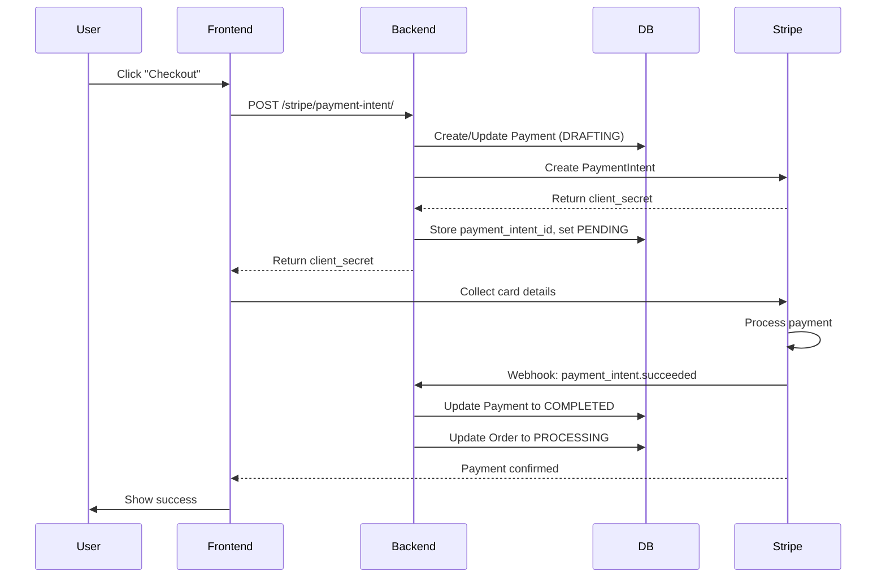
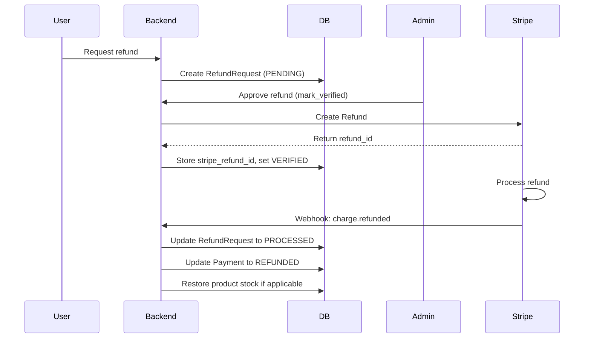

# Stripe Payment Integration

Professional Stripe integration for handling payments and refunds on Orders and Bookings.

## Features

- **PaymentIntent Creation**: Lazy creation on checkout
- **Webhook Processing**: Automatic payment status updates
- **Refund Automation**: Automatic Stripe refunds on admin verification
- **Reconciliation**: Retry mechanism for missed webhooks
- **Security**: Signature verification, idempotency keys, frozen metadata
- **Test/Live Mode**: Environment-based configuration

## Architecture

```
apps/payments/services/stripe/
├── client.py              # Stripe SDK initialization & config
├── payment_intents.py     # PaymentIntent CRUD operations
├── refunds.py            # Refund creation & retrieval
├── webhooks.py           # Event handlers & signature verification
└── exceptions.py         # Error mapping & user-friendly messages
```

## Environment Variables

### Required

```bash
# AWS SSM Parameter Store keys (or local environment variables)

# Test Mode
STRIPE_TEST_MODE=True
STRIPE_SECRET_KEY_TEST=sk_test_xxx
STRIPE_PUBLISHABLE_KEY_TEST=pk_test_xxx
STRIPE_WEBHOOK_SECRET=whsec_xxx

# Live Mode (set STRIPE_TEST_MODE=False)
STRIPE_SECRET_KEY_LIVE=sk_live_xxx
STRIPE_PUBLISHABLE_KEY_LIVE=pk_live_xxx
```

### Optional

```bash
STRIPE_API_VERSION=2024-12-18  # Pin API version (uses Stripe default if not set)
```

## Setup Instructions

### 1. Install Stripe SDK

```bash
pip install stripe
```

### 2. Configure Environment

Add the environment variables above to:
- **Local Development**: `.env` file or system environment
- **Production**: AWS SSM Parameter Store (existing pattern)

### 3. Run Database Migrations

The Payment model now includes indexed Stripe fields:

```bash
python manage.py makemigrations payments
python manage.py migrate payments
```

### 4. Configure Webhook Endpoint

#### Local Development (using Stripe CLI)

```bash
# Install Stripe CLI: https://stripe.com/docs/stripe-cli
stripe login

# Forward webhooks to local server (KEEP THIS RUNNING)
stripe listen --forward-to http://localhost:8000/api/stripe/webhook/

# Copy the webhook signing secret (whsec_xxx) to STRIPE_WEBHOOK_SECRET

# To testm in ANOTHER console with the listen command still running in another console
stipe trigger payment_intent.succeeded 
```

#### Production

1. Go to Stripe Dashboard → Developers → Webhooks
2. Add endpoint: `https://yourdomain.com/api/payments/stripe/webhook/`
3. Select events:
   - `payment_intent.succeeded`
   - `payment_intent.payment_failed`
   - `payment_intent.canceled`
   - `charge.refunded`
   - `charge.dispute.created`
4. Copy the signing secret to `STRIPE_WEBHOOK_SECRET` in SSM

### 5. Configure Celery Periodic Tasks (Optional)

For automatic reconciliation of stale payments:

```python
# In core/celery.py or wherever you configure beat schedule
from celery.schedules import crontab

app.conf.beat_schedule = {
    'sync-stale-stripe-payments': {
        'task': 'apps.payments.tasks.stripe_reconciliation.sync_stale_pending_payments',
        'schedule': crontab(minute='*/15'),  # Every 15 minutes
        'kwargs': {'max_age_minutes': 30, 'batch_size': 50}
    },
}
```

## API Endpoints

### Get Stripe Configuration (Public)

```http
GET /api/payments/stripe/config/

Response:
{
  "publishable_key": "pk_test_xxx",
  "test_mode": true
}
```

### Create PaymentIntent

```http
POST /api/payments/stripe/payment-intent/
Authorization: Bearer <token>

Request:
{
  "target_type": "order",  // or "booking"
  "target_id": 123,
  "payment_method_id": 1   // Optional
}

Response:
{
  "client_secret": "pi_xxx_secret_yyy",
  "payment_intent_id": "pi_xxx",
  "publishable_key": "pk_test_xxx",
  "amount": "58.00",
  "currency": "gbp",
  "payment_reference": "PAY-TC2025-12345",
  "test_mode": true
}
```

### Webhook (Stripe → Server)

```http
POST /api/payments/stripe/webhook/
Stripe-Signature: t=xxx,v1=yyy

# Handled automatically by Stripe
# No CSRF token required
# Signature verified server-side
```

### Manual Payment Confirmation (Optional)

```http
POST /api/payments/stripe/confirm/
Authorization: Bearer <token>

Request:
{
  "payment_intent_id": "pi_xxx",
  "payment_method": "pm_xxx"  // Optional
}
```

## Frontend Integration

### 1. Get Configuration

```javascript
const config = await fetch('/api/payments/stripe/config/').then(r => r.json());
const stripe = Stripe(config.publishable_key);
```

### 2. Create PaymentIntent

```javascript
const response = await fetch('/api/payments/stripe/payment-intent/', {
  method: 'POST',
  headers: {
    'Authorization': `Bearer ${token}`,
    'Content-Type': 'application/json'
  },
  body: JSON.stringify({
    target_type: 'order',
    target_id: orderId
  })
});

const { client_secret, amount, currency } = await response.json();
```

### 3. Collect Payment

```javascript
const { error } = await stripe.confirmPayment({
  clientSecret: client_secret,
  elements,  // Stripe Elements instance
  confirmParams: {
    return_url: 'https://yourdomain.com/order/success'
  }
});
```

### 4. Handle Result

```javascript
// On return_url page
const stripe = Stripe(publishable_key);
const clientSecret = new URLSearchParams(window.location.search).get('payment_intent_client_secret');

const { paymentIntent } = await stripe.retrievePaymentIntent(clientSecret);

if (paymentIntent.status === 'succeeded') {
  // Payment successful - webhook already updated DB
  showSuccessMessage();
}
```

## Payment Flow



## Refund Flow



## Security Features

### 1. Signature Verification

All webhooks are verified using Stripe's signature:

```python
stripe.Webhook.construct_event(payload, signature, webhook_secret)
```

Invalid signatures are rejected with 400 Bad Request.

### 2. Idempotency Keys

Prevents duplicate charges on retry:

```python
# Uses payment_reference as idempotency key
PaymentIntent.create(..., idempotency_key=payment_reference)
```

### 3. Frozen Metadata

Payment amounts stored in `metadata` at creation time prevent price manipulation:

```python
# At payment time
payment.metadata = {
    'order_items': [...],  # Frozen pricing
    'total_amount': '58.00'
}

# At refund time - use frozen data
refund_amount = payment.metadata['order_items'][0]['total_amount']
```

### 4. Event Deduplication

Stripe may send duplicate events. We track processed event IDs:

```python
if event_id in payment.metadata.get('stripe_event_ids', []):
    return 'already_processed'
```

### 5. Status Transition Validation

```python
payment.transition_to(new_status)  # Validates against ALLOWED_STATUS_TRANSITIONS
```

## Reconciliation & Error Recovery

### Automatic Reconciliation

Celery task runs every 15 minutes to sync stale payments:

```python
@shared_task
def sync_stale_pending_payments(max_age_minutes=30):
    # Finds payments in PENDING for > 30 minutes
    # Queries Stripe API for current status
    # Updates local database
```

### Manual Reconciliation

```bash
# Via Django shell
from apps.payments.tasks.stripe_reconciliation import reconcile_payment_by_reference
reconcile_payment_by_reference.delay('PAY-TC2025-12345')

# Or via Celery directly
celery -A core call apps.payments.tasks.stripe_reconciliation.reconcile_stripe_payment --args='["payment-uuid"]'
```

### Retry Mechanism

- **Max retries**: 5
- **Backoff**: Exponential (60s, 120s, 240s, 480s, 960s)
- **Auto-retry on**: Stripe API errors
- **No retry on**: Invalid payment, payment not found

## Testing

### Test Mode

Set `STRIPE_TEST_MODE=True` to use test keys. All cards from [Stripe test cards](https://stripe.com/docs/testing) will work:

```
4242 4242 4242 4242  # Successful payment
4000 0000 0000 0002  # Declined card
4000 0025 0000 3155  # Requires authentication (3D Secure)
```

### Webhook Testing

```bash
# Trigger test webhook
stripe trigger payment_intent.succeeded

# Monitor webhook events
stripe listen --print-json
```

### Unit Tests

Run the test suite:

```bash
python manage.py test apps.payments.tests.stripe_tests
```

## Troubleshooting

### Webhook not received

1. **Check webhook secret**: Verify `STRIPE_WEBHOOK_SECRET` matches Dashboard
2. **Check signature**: Look for `400 Bad Request` in logs
3. **Check URL**: Ensure webhook URL is publicly accessible (no localhost in production)
4. **Check firewall**: Ensure port 443 open for Stripe IPs
5. **Manual reconciliation**: Use `reconcile_payment_by_reference` task

### Payment stuck in PENDING

1. **Wait 15 minutes**: Auto-reconciliation will sync
2. **Manual reconciliation**: Run `reconcile_stripe_payment` task
3. **Check Stripe Dashboard**: Look for PaymentIntent status
4. **Check logs**: Look for webhook processing errors

### Refund failed

1. **Check payment status**: Must be COMPLETED
2. **Check amount**: Cannot exceed original payment
3. **Check Stripe balance**: Ensure sufficient funds
4. **Check logs**: Look for Stripe error codes
5. **Manual refund**: Use Stripe Dashboard, then update DB manually

### Test/Live mode mismatch

```python
# Symptom: "No such payment_intent" error
# Cause: Using test key with live payment_intent (or vice versa)

# Solution: Check environment
from apps.payments.services.stripe.client import StripeClient
print(StripeClient.is_test_mode())  # Should match your intent
```

## Support

For issues or questions:
1. Check logs: `apps/payments` logger
2. Check Stripe Dashboard: Logs → Events
3. Review PaymentHistoryAction records for audit trail
4. Contact AMDG Platform Team

## Version History

- **1.0.0** (2026-01-11): Initial Stripe integration
  - PaymentIntent creation
  - Webhook handling (5 events)
  - Automatic refunds
  - Reconciliation tasks
  - Test/Live mode support
